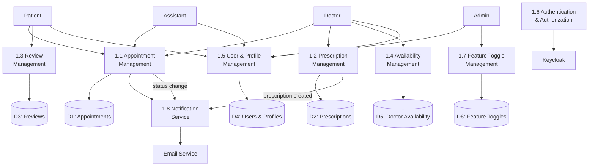
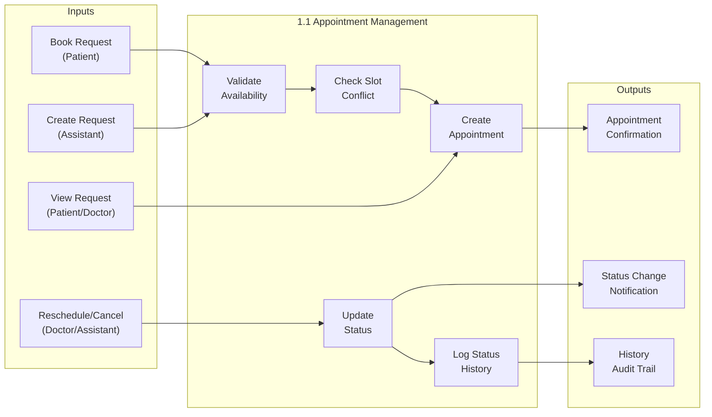
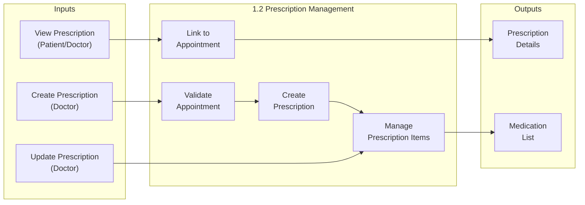
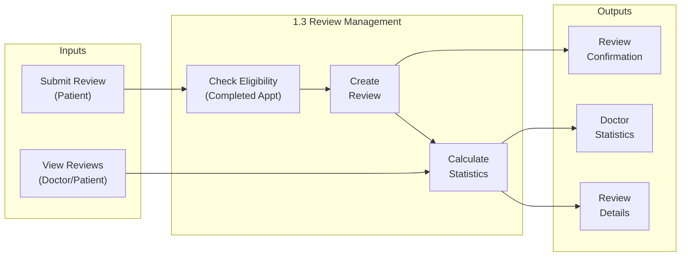
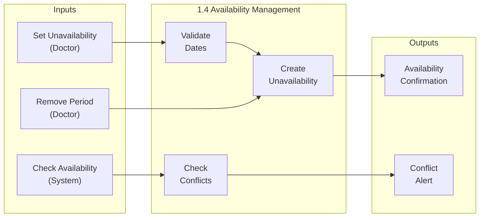
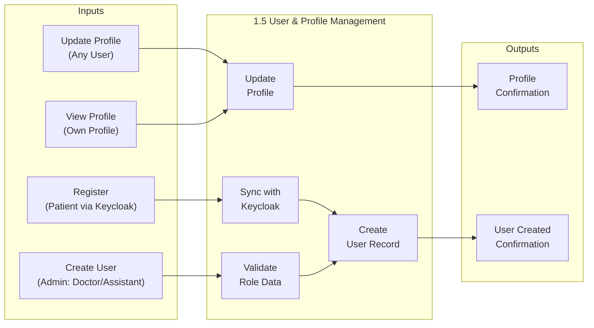
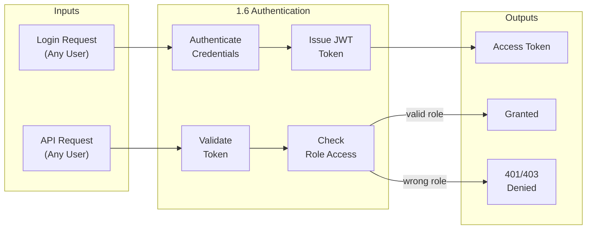
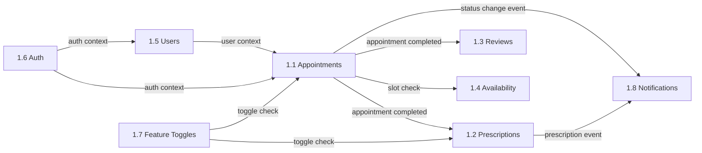

# DFD — Level 1: Detailed Processes

Level 1 breaks down the system into its core functional processes, showing data flows between processes, data stores, and external entities.

## Overview Diagram



---

## Process 1.1 — Appointment Management

Handles the full lifecycle of appointments: creation, modification, cancellation, and status tracking.



### Data Flows — Process 1.1

| ID | Flow | Description |
|----|------|-------------|
| F1.1a | Book Request → Validate | Patient submits appointment request with doctor, date, time |
| F1.1b | Create Request → Validate | Assistant creates appointment on behalf of patient |
| F1.1c | Validate → Check Slot | System checks doctor availability for requested slot |
| F1.1d | Check Slot → Create | No conflict found — appointment created with status SCHEDULED |
| F1.1e | Reschedule/Cancel → Update Status | Doctor or assistant changes status or scheduled time |
| F1.1f | Update Status → Log History | Status change recorded in AppointmentStatusChange table |
| F1.1g | Create → Confirmation | Confirmation sent to patient (portal + optional email) |

### Status Transition Rules

```
SCHEDULED ──→ CONFIRMED ──→ COMPLETED
    │              │
    └──→ CANCELLED ←┘
```

- **SCHEDULED → CONFIRMED**: Doctor or assistant confirms the appointment
- **CONFIRMED → COMPLETED**: Doctor marks appointment as completed
- **SCHEDULED → CANCELLED**: Patient, doctor, or assistant cancels
- **CONFIRMED → CANCELLED**: Patient, doctor, or assistant cancels
- **COMPLETED / CANCELLED**: Terminal states — no further transitions

### Business Rules

| Rule | Description |
|------|-------------|
| BR-APT-01 | An appointment must reference an existing patient and doctor |
| BR-APT-02 | The scheduled time must be in the future |
| BR-APT-03 | The doctor must not have a conflicting appointment at the same time |
| BR-APT-04 | The doctor must not have an unavailability period covering the scheduled date |
| BR-APT-05 | Only allowed status transitions are permitted (see shared-types) |
| BR-APT-06 | Every status change is logged with the changer's Keycloak ID and timestamp |

---

## Process 1.2 — Prescription Management

Doctors create, update, and view prescriptions linked to completed appointments.



### Data Flows — Process 1.2

| ID | Flow | Description |
|----|------|-------------|
| F1.2a | Create Prescription → Validate | Doctor initiates prescription for a completed appointment |
| F1.2b | Validate → Create | System verifies appointment exists and belongs to this doctor |
| F1.2c | Create → Manage Items | Doctor adds medication items (name, dosage, frequency, duration) |
| F1.2d | Update Prescription → Manage Items | Doctor modifies existing prescription items |
| F1.2e | View Prescription → Link to Appointment | Patient or doctor retrieves prescription with appointment context |

### Business Rules

| Rule | Description |
|------|-------------|
| BR-RX-01 | A prescription must be linked to an existing appointment |
| BR-RX-02 | Each appointment can have at most one prescription |
| BR-RX-03 | A prescription must contain at least one medication item |
| BR-RX-04 | Each item must include: medication name, dosage, frequency, duration |
| BR-RX-05 | Only the doctor who owns the appointment can create/modify the prescription |
| BR-RX-06 | Patients can view but not modify prescriptions |

---

## Process 1.3 — Review Management

Patients submit reviews for completed appointments; doctors and assistants can view them.



### Data Flows — Process 1.3

| ID | Flow | Description |
|----|------|-------------|
| F1.3a | Submit Review → Check Eligibility | Patient submits review for a specific appointment |
| F1.3b | Check → Create | System verifies appointment is COMPLETED and has no existing review |
| F1.3c | Create → Calculate Statistics | New review triggers recalculation of doctor's average rating |
| F1.3d | View Reviews → Statistics | Doctor or patient retrieves review data with aggregated stats |

### Business Rules

| Rule | Description |
|------|-------------|
| BR-REV-01 | Reviews can only be submitted for appointments with status COMPLETED |
| BR-REV-02 | Each appointment can have at most one review |
| BR-REV-03 | Only the patient who owned the appointment can submit a review |
| BR-REV-04 | Rating must be an integer (1–5 scale implied) |
| BR-REV-05 | Comment is optional |
| BR-REV-06 | Doctors can view reviews but not modify or delete them |

---

## Process 1.4 — Availability Management

Doctors define periods of unavailability (vacation, conferences, etc.).



### Data Flows — Process 1.4

| ID | Flow | Description |
|----|------|-------------|
| F1.4a | Set Unavailability → Validate | Doctor specifies start and end date for unavailability |
| F1.4b | Validate → Create | System validates dates (start ≤ end, not in past) |
| F1.4c | Check Availability → Conflict Alert | System checks for existing appointments during the period |

### Business Rules

| Rule | Description |
|------|-------------|
| BR-AVL-01 | Start date must be on or before end date |
| BR-AVL-02 | The unavailability period must not be in the past |
| BR-AVL-03 | Only the doctor themselves can manage their availability |
| BR-AVL-04 | Reason is optional (e.g., "Vacation", "Conference") |
| BR-AVL-05 | Setting unavailability does NOT auto-cancel existing appointments |

---

## Process 1.5 — User & Profile Management

Handles user registration, profile updates, and role-specific data management.



### Data Flows — Process 1.5

| ID | Flow | Description |
|----|------|-------------|
| F1.5a | Register → Sync | New patient self-registers via Keycloak |
| F1.5b | Sync → Create User Record | System creates User + Patient records from Keycloak data |
| F1.5c | Create User → Validate | Admin creates doctor or assistant account |
| F1.5d | Validate → Create User Record | System creates User + role-specific record (Doctor/Assistant) |
| F1.5e | Update Profile → Update | User modifies own profile data |
| F1.5f | View Profile → Update | User retrieves current profile information |

### Business Rules

| Rule | Description |
|------|-------------|
| BR-USR-01 | Patient self-registration is handled by Keycloak; system syncs on first login |
| BR-USR-02 | Only admins can create doctor and assistant accounts |
| BR-USR-03 | Email must be unique across all users |
| BR-USR-04 | Each user has exactly one role-specific record (Patient/Doctor/Assistant) |
| BR-USR-05 | Profile updates sync to Keycloak where applicable (name, email) |
| BR-USR-06 | Soft-deleted users retain their data but are excluded from active queries |

---

## Process 1.6 — Authentication & Authorization

Keycloak integration for login, token validation, and role-based access control.



### Data Flows — Process 1.6

| ID | Flow | Description |
|----|------|-------------|
| F1.6a | Login → Authenticate | User submits credentials to Keycloak |
| F1.6b | Authenticate → Token | Keycloak validates and issues JWT with role claim |
| F1.6c | API Request → Validate | API verifies JWT signature and expiration |
| F1.6d | Validate → Check Role | API extracts role from token and checks endpoint permission |
| F1.6e | Check Role → Granted/Denied | Access allowed or rejected based on role |

### API Endpoint Access Matrix

| Endpoint Domain | Patient | Doctor | Assistant | Admin |
|-----------------|---------|--------|-----------|-------|
| Appointments (own) | ✅ | ✅ | ✅ | — |
| Appointments (all) | — | — | ✅ | ✅ |
| Prescriptions (own) | ✅ | ✅ | — | — |
| Reviews (own) | ✅ | ✅ | — | — |
| Doctor Availability | ✅ (read) | ✅ (write) | — | — |
| User Management | — | — | — | ✅ |
| Feature Toggles | — | — | — | ✅ |

---

## Process 1.7 — Feature Toggle Management

Admins control runtime feature flags for gradual rollouts and bug workarounds.

### Data Flows — Process 1.7

| ID | Flow | Description |
|----|------|-------------|
| F1.7a | Toggle Request → Update | Admin enables/disables a feature flag |
| F1.7b | Config Update → Store | Admin modifies toggle configuration (e.g., delay ranges) |
| F1.7c | API Request → Check Flag | API checks feature toggle before executing behavior |

### Known Feature Toggles

| Key | Purpose | Config |
|-----|---------|--------|
| `bug:api-slowdown` | Simulates API latency for testing | `{ minDelayMs, maxDelayMs }` |
| `bug:same-day-restriction` | Restricts same-day appointments | — |
| `bug:profile-validation-frontend` | Enables frontend profile validation bug | — |
| `bug:profile-validation-backend` | Enables backend profile validation bug | — |
| `bug:show-footer-logo` | Toggles footer logo visibility | — |

---

## Process 1.8 — Notification Service

Sends email notifications for appointment lifecycle events.

### Data Flows — Process 1.8

| ID | Flow | Description |
|----|------|-------------|
| F1.8a | Appointment Created → Send | Confirmation email sent to patient |
| F1.8b | Status Changed → Send | Status update notification sent to patient |
| F1.8c | Prescription Created → Send | Prescription ready notification sent to patient |

### Business Rules

| Rule | Description |
|------|-------------|
| BR-NOT-01 | Notifications respect patient's `emailNotificationsEnabled` preference |
| BR-NOT-02 | In development, all emails are captured by Mailpit (port 8025) |
| BR-NOT-03 | Notifications are sent asynchronously via the events system |

---

## Cross-Process Data Flows


