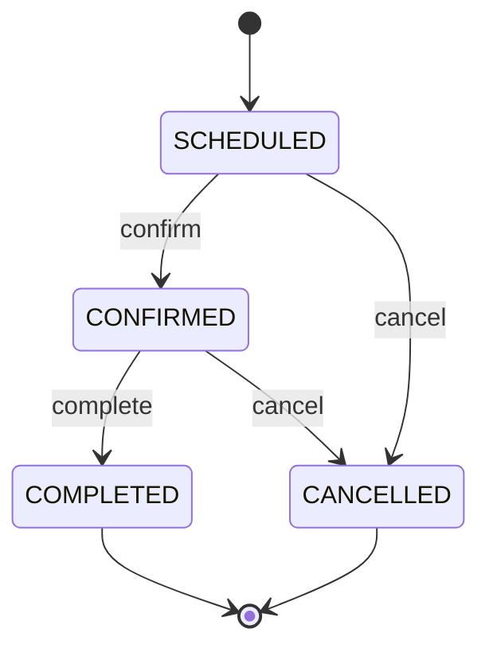

# Entity Relationship Diagram (ERD)

This document describes the database schema for Cerios Clinic, derived from the Prisma schema (`packages/database/prisma/schema.prisma`).

## ER Diagram

```mermaid
erDiagram
    USER {
        id PK
        keycloak_id UK
        email UK
        first_name
        last_name
        role
        created_at
        updated_at
        deleted_at
    }

    PATIENT {
        id PK
        user_id FK UK
        date_of_birth
        phone
        insurance_number
        photo
        email_notifications_enabled
        updated_at
    }

    DOCTOR {
        id PK
        user_id FK UK
        specialization
        license_number
        updated_at
    }

    ASSISTANT {
        id PK
        user_id FK UK
        department
        updated_at
    }

    APPOINTMENT {
        id PK
        patient_id FK
        doctor_id FK
        assistant_id FK
        scheduled_at
        status
        notes
        created_at
        updated_at
    }

    APPOINTMENT_STATUS_CHANGE {
        id PK
        appointment_id FK
        previous_status
        new_status
        previous_scheduled_at
        new_scheduled_at
        changed_by_keycloak_id
        changed_at
    }

    REVIEW {
        id PK
        appointment_id FK UK
        patient_id FK
        doctor_id FK
        rating
        comment
        created_at
    }

    PRESCRIPTION {
        id PK
        appointment_id FK UK
        patient_id FK
        doctor_id FK
        notes
        created_at
        updated_at
    }

    PRESCRIPTION_ITEM {
        id PK
        prescription_id FK
        medication_name
        dosage
        frequency
        duration
        instructions
    }

    DOCTOR_UNAVAILABILITY {
        id PK
        doctor_id FK
        start_date
        end_date
        reason
        created_at
    }

    FEATURE_TOGGLE {
        id PK
        key UK
        enabled
        description
        config
        created_at
        updated_at
    }

    USER ||--o| PATIENT : "has profile"
    USER ||--o| DOCTOR : "has profile"
    USER ||--o| ASSISTANT : "has profile"

    PATIENT ||--o{ APPOINTMENT : "books"
    DOCTOR ||--o{ APPOINTMENT : "conducts"
    ASSISTANT ||--o{ APPOINTMENT : "manages"

    APPOINTMENT ||--o{ APPOINTMENT_STATUS_CHANGE : "has history"
    APPOINTMENT ||--o| REVIEW : "receives"
    APPOINTMENT ||--o| PRESCRIPTION : "generates"

    PATIENT ||--o{ REVIEW : "writes"
    DOCTOR ||--o{ REVIEW : "receives"

    PATIENT ||--o{ PRESCRIPTION : "receives"
    DOCTOR ||--o{ PRESCRIPTION : "issues"
    PRESCRIPTION ||--o{ PRESCRIPTION_ITEM : "contains"

    DOCTOR ||--o{ DOCTOR_UNAVAILABILITY : "defines"
```

## Enumerations

### UserRole

| Value | Description |
|-------|-------------|
| `patient` | Patient — can book appointments, view prescriptions, submit reviews |
| `doctor` | Doctor — manages schedule, creates prescriptions, views patients |
| `assistant` | Assistant — reception staff managing appointments |
| `admin` | Administrator — system-wide user and feature management |

### AppointmentStatus

| Value | Description | Terminal |
|-------|-------------|----------|
| `SCHEDULED` | Initial state after appointment creation | No |
| `CONFIRMED` | Doctor or assistant has confirmed the appointment | No |
| `COMPLETED` | Appointment has been conducted | Yes |
| `CANCELLED` | Appointment has been cancelled | Yes |

### Allowed Status Transitions



## Entity Descriptions

### User
Central identity record linked to Keycloak. Every person in the system (patient, doctor, assistant, admin) has a User record. Supports soft deletion via `deleted_at`.

**Key fields:**
- `keycloak_id` — External identity provider reference (unique)
- `role` — Determines portal access and API permissions

### Patient
Extended profile for patients. One-to-one relationship with User.

**Key fields:**
- `date_of_birth` — Used for age-based eligibility checks
- `insurance_number` — Insurance reference (optional)
- `photo` — Profile photo path
- `email_notifications_enabled` — Opt-in/out for email notifications

### Doctor
Extended profile for doctors. One-to-one relationship with User.

**Key fields:**
- `specialization` — Medical specialty (e.g., "Cardiology", "General Practice")
- `license_number` — Medical license reference

### Assistant
Extended profile for reception staff. One-to-one relationship with User.

**Key fields:**
- `department` — Department assignment (e.g., "Reception", "Cardiology Wing")

### Appointment
Core entity linking a patient, doctor, and optional assistant for a specific time slot.

**Key fields:**
- `scheduled_at` — Date and time of the appointment
- `status` — Current lifecycle state (see AppointmentStatus)
- `notes` — Optional free-text notes

**Indexes:**
- `patient_id` — Fast lookup of patient's appointments
- `doctor_id` — Fast lookup of doctor's schedule
- `scheduled_at` — Range queries for date-based filtering
- `status` — Filtering by status
- `patient_id + status` — Combined queries (e.g., "patient's upcoming appointments")
- `patient_id + scheduled_at` — Patient timeline queries
- `doctor_id + scheduled_at` — Doctor calendar queries

### AppointmentStatusChange
Immutable audit log of every status or schedule change on an appointment.

**Key fields:**
- `previous_status` / `new_status` — The transition that occurred
- `previous_scheduled_at` / `new_scheduled_at` — If rescheduled, the old and new times
- `changed_by_keycloak_id` — Who made the change

### Review
Patient feedback on a completed appointment. One-to-one with Appointment.

**Key fields:**
- `rating` — Numeric rating
- `comment` — Optional text feedback

### Prescription
Medication order issued by a doctor for a specific appointment. One-to-one with Appointment.

**Key fields:**
- `notes` — Doctor's general notes
- `items` — List of individual medications (see PrescriptionItem)

### PrescriptionItem
Individual medication within a prescription. Cascade-deletes when the parent prescription is removed.

**Key fields:**
- `medication_name` — Name of the medication
- `dosage` — Dosage instructions (e.g., "500mg")
- `frequency` — How often (e.g., "3x daily")
- `duration` — Treatment duration (e.g., "7 days")
- `instructions` — Additional instructions (optional)

### DoctorUnavailability
Period during which a doctor cannot accept appointments.

**Key fields:**
- `start_date` / `end_date` — Unavailability window
- `reason` — Optional explanation (e.g., "Vacation")

**Composite index:** `(doctor_id, start_date, end_date)` — Efficient overlap queries.

### FeatureToggle
Runtime feature flags managed by admins. Used for controlled rollouts and bug simulation.

**Key fields:**
- `key` — Unique identifier (e.g., `bug:api-slowdown`)
- `enabled` — Whether the feature is active
- `config` — JSON configuration (e.g., `{ minDelayMs: 1000, maxDelayMs: 5000 }`)

## Relationship Summary

| Relationship | Cardinality | Description |
|-------------|-------------|-------------|
| User → Patient/Doctor/Assistant | 1:0..1 | Each user has at most one role profile |
| Patient → Appointments | 1:N | A patient can have many appointments |
| Doctor → Appointments | 1:N | A doctor can have many appointments |
| Assistant → Appointments | 1:N | An assistant can manage many appointments |
| Appointment → StatusChanges | 1:N | Each appointment tracks its full history |
| Appointment → Review | 1:0..1 | An appointment may have one review |
| Appointment → Prescription | 1:0..1 | An appointment may have one prescription |
| Prescription → PrescriptionItems | 1:N | A prescription contains one or more medications |
| Doctor → Unavailability | 1:N | A doctor can define many unavailability periods |

## Data Volume Estimates

| Entity | Estimated Volume | Growth Pattern |
|--------|-----------------|----------------|
| Users | 100–500 | Slow (admin-managed) |
| Appointments | 1,000–10,000/year | Linear with patients |
| StatusChanges | 2–5x Appointments | Proportional to appointment edits |
| Reviews | ≤ Appointments | One per completed appointment |
| Prescriptions | ≤ Completed Appointments | One per completed appointment |
| PrescriptionItems | 1–10x Prescriptions | 1–10 medications per prescription |
| DoctorUnavailability | 10–50/year per doctor | Seasonal patterns |
| FeatureToggles | 5–20 | Slow (admin-managed) |
