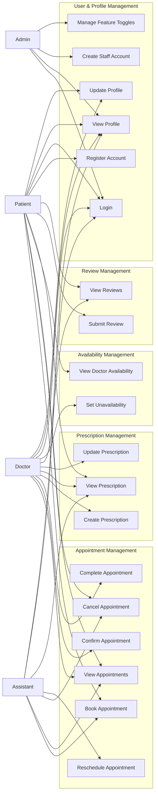

# Use Cases

This document defines the functional use cases for Cerios Clinic, organized by actor (user role).

## Use Case Diagram

---

## Appointment Management

### UC-01: Book Appointment

| Field | Value |
|-------|-------|
| **ID** | UC-01 |
| **Name** | Book Appointment |
| **Actor(s)** | Patient, Assistant |
| **Precondition** | Patient is authenticated; Doctor exists in the system |
| **Postcondition** | Appointment is created with status SCHEDULED |
| **Priority** | High |

**Main Flow:**

1. Actor selects a doctor from the available doctors list
2. System displays available time slots for the selected doctor
3. Actor selects a date and time slot
4. Actor optionally adds notes
5. System validates:
   - Slot is not already booked
   - Doctor is not unavailable during the selected period
   - Scheduled time is in the future
6. System creates the appointment with status `SCHEDULED`
7. System logs the status change in AppointmentStatusChange
8. System sends confirmation notification to the patient
9. System displays confirmation to the actor

**Alternative Flows:**

- **3a. Slot is unavailable:** System displays error "This time slot is no longer available" and returns to step 2
- **5a. Doctor is unavailable:** System displays error "Doctor is not available during this period" and returns to step 2
- **5b. Past date selected:** System displays error "Cannot book appointments in the past"

**Extensions:**

- Assistant can book on behalf of any patient (selects patient from list)
- Patient can only book for themselves

---

### UC-02: View Appointments

| Field | Value |
|-------|-------|
| **ID** | UC-02 |
| **Name** | View Appointments |
| **Actor(s)** | Patient, Doctor, Assistant, Admin |
| **Precondition** | Actor is authenticated |
| **Postcondition** | Appointments are displayed |
| **Priority** | High |

**Main Flow:**

1. Actor navigates to appointments view
2. System retrieves appointments based on actor's role:
   - **Patient:** Own appointments only
   - **Doctor:** Appointments where actor is the doctor
   - **Assistant:** All appointments
   - **Admin:** All appointments
3. System optionally filters by status, date range, doctor, or patient
4. System displays appointment list with: date/time, doctor/patient name, status
5. Actor can select an appointment to view details

**Alternative Flows:**

- **3a. No appointments found:** System displays "No appointments found" message
- **4a. Filter applied:** System refreshes list with filtered results

---

### UC-03: Cancel Appointment

| Field | Value |
|-------|-------|
| **ID** | UC-03 |
| **Name** | Cancel Appointment |
| **Actor(s)** | Patient, Doctor, Assistant |
| **Precondition** | Appointment exists with status SCHEDULED or CONFIRMED |
| **Postcondition** | Appointment status changes to CANCELLED |
| **Priority** | High |

**Main Flow:**

1. Actor selects appointment to cancel
2. System displays appointment details and asks for confirmation
3. Actor confirms cancellation
4. System validates status allows cancellation (SCHEDULED or CONFIRMED)
5. System updates status to `CANCELLED`
6. System logs the status change
7. System sends cancellation notification to patient

**Alternative Flows:**

- **2a. Actor cancels confirmation:** Returns to appointment list
- **4a. Status is COMPLETED:** System displays error "Cannot cancel a completed appointment"
- **4b. Status is CANCELLED:** System displays error "Appointment is already cancelled"

---

### UC-04: Reschedule Appointment

| Field | Value |
|-------|-------|
| **ID** | UC-04 |
| **Name** | Reschedule Appointment |
| **Actor(s)** | Assistant |
| **Precondition** | Appointment exists with status SCHEDULED or CONFIRMED |
| **Postcondition** | Appointment time is updated |
| **Priority** | Medium |

**Main Flow:**

1. Actor selects appointment to reschedule
2. System displays current appointment details
3. Actor selects new date and time
4. System validates:
   - New slot is available
   - Doctor is not unavailable during the new period
   - New time is in the future
5. System updates `scheduled_at` and logs the change
6. System displays confirmation

**Alternative Flows:**

- **4a. New slot unavailable:** System displays error and returns to step 3
- **4b. Doctor unavailable:** System displays error and returns to step 3

---

### UC-05: Confirm Appointment

| Field | Value |
|-------|-------|
| **ID** | UC-05 |
| **Name** | Confirm Appointment |
| **Actor(s)** | Doctor, Assistant |
| **Precondition** | Appointment exists with status SCHEDULED |
| **Postcondition** | Appointment status changes to CONFIRMED |
| **Priority** | Medium |

**Main Flow:**

1. Actor selects a SCHEDULED appointment
2. System displays appointment details
3. Actor confirms the appointment
4. System updates status to `CONFIRMED`
5. System logs the status change

---

### UC-06: Complete Appointment

| Field | Value |
|-------|-------|
| **ID** | UC-06 |
| **Name** | Complete Appointment |
| **Actor(s)** | Doctor |
| **Precondition** | Appointment exists with status CONFIRMED |
| **Postcondition** | Appointment status changes to COMPLETED |
| **Priority** | High |

**Main Flow:**

1. Doctor selects a CONFIRMED appointment
2. System displays appointment details
3. Doctor marks appointment as completed
4. System updates status to `COMPLETED`
5. System logs the status change
6. System enables review submission for the patient
7. System enables prescription creation for the doctor

**Business Rules:**

- Only the assigned doctor can complete an appointment
- Prescription and review can only be created after completion

---

## Prescription Management

### UC-07: Create Prescription

| Field | Value |
|-------|-------|
| **ID** | UC-07 |
| **Name** | Create Prescription |
| **Actor(s)** | Doctor |
| **Precondition** | Doctor has a COMPLETED appointment; no prescription exists yet |
| **Postcondition** | Prescription with items is created |
| **Priority** | High |

**Main Flow:**

1. Doctor selects a completed appointment
2. System displays "Create Prescription" option
3. Doctor enters prescription notes (optional)
4. Doctor adds medication items:
   - Medication name
   - Dosage (e.g., "500mg")
   - Frequency (e.g., "3x daily")
   - Duration (e.g., "7 days")
   - Instructions (optional)
5. Doctor adds additional items as needed (minimum 1)
6. Doctor saves the prescription
7. System validates:
   - Appointment is COMPLETED
   - No prescription exists for this appointment
   - At least one item is provided
   - All required fields are filled
8. System creates Prescription and PrescriptionItems
9. System sends notification to patient

**Alternative Flows:**

- **7a. Appointment not completed:** System displays error
- **7b. Prescription already exists:** System displays error "Prescription already exists for this appointment"

---

### UC-08: View Prescription

| Field | Value |
|-------|-------|
| **ID** | UC-08 |
| **Name** | View Prescription |
| **Actor(s)** | Patient, Doctor, Assistant |
| **Precondition** | Prescription exists for an appointment |
| **Postcondition** | Prescription details are displayed |
| **Priority** | Medium |

**Main Flow:**

1. Actor navigates to prescriptions view
2. System retrieves prescriptions based on role:
   - **Patient:** Own prescriptions only
   - **Doctor:** Prescriptions for doctor's appointments
   - **Assistant:** All prescriptions
3. System displays prescription list
4. Actor selects a prescription to view details
5. System displays: appointment info, medication items, notes, dates

---

### UC-09: Update Prescription

| Field | Value |
|-------|-------|
| **ID** | UC-09 |
| **Name** | Update Prescription |
| **Actor(s)** | Doctor |
| **Precondition** | Prescription exists; doctor is the owner |
| **Postcondition** | Prescription is updated |
| **Priority** | Low |

**Main Flow:**

1. Doctor selects an existing prescription
2. System displays current prescription details
3. Doctor modifies notes or medication items
4. Doctor saves changes
5. System validates and updates the prescription

---

## Review Management

### UC-10: Submit Review

| Field | Value |
|-------|-------|
| **ID** | UC-10 |
| **Name** | Submit Review |
| **Actor(s)** | Patient |
| **Precondition** | Patient has a COMPLETED appointment; no review exists yet |
| **Postcondition** | Review is created |
| **Priority** | Medium |

**Main Flow:**

1. Patient selects a completed appointment
2. System displays "Leave Review" option
3. Patient selects a rating (1–5)
4. Patient optionally enters a comment
5. Patient submits the review
6. System validates:
   - Appointment status is COMPLETED
   - No review exists for this appointment
   - Patient owns the appointment
7. System creates the review
8. System recalculates doctor's average rating
9. System displays confirmation

**Alternative Flows:**

- **6a. Appointment not completed:** System displays error
- **6b. Review already exists:** System displays error "You have already reviewed this appointment"

---

### UC-11: View Reviews

| Field | Value |
|-------|-------|
| **ID** | UC-11 |
| **Name** | View Reviews |
| **Actor(s)** | Patient, Doctor |
| **Precondition** | Actor is authenticated |
| **Postcondition** | Reviews are displayed |
| **Priority** | Low |

**Main Flow:**

1. Actor navigates to reviews view
2. System retrieves reviews based on role:
   - **Patient:** Reviews written by this patient
   - **Doctor:** Reviews received by this doctor
3. System displays reviews with rating, comment, date, and appointment info
4. System displays aggregate statistics (average rating, total reviews)

---

## Availability Management

### UC-12: Set Unavailability

| Field | Value |
|-------|-------|
| **ID** | UC-12 |
| **Name** | Set Unavailability Period |
| **Actor(s)** | Doctor |
| **Precondition** | Doctor is authenticated |
| **Postcondition** | Unavailability period is recorded |
| **Priority** | Medium |

**Main Flow:**

1. Doctor navigates to availability settings
2. Doctor selects start date and end date
3. Doctor optionally enters a reason (e.g., "Vacation")
4. System validates:
   - Start date ≤ End date
   - Dates are not in the past
5. System creates the unavailability record
6. System displays confirmation

**Alternative Flows:**

- **4a. Invalid dates:** System displays error "Start date must be before or equal to end date"
- **4b. Past dates:** System displays error "Cannot set unavailability in the past"

**Note:** Setting unavailability does NOT cancel existing appointments during the period. Existing appointments remain scheduled.

---

### UC-13: View Doctor Availability

| Field | Value |
|-------|-------|
| **ID** | UC-13 |
| **Name** | View Doctor Availability |
| **Actor(s)** | Patient |
| **Precondition** | Patient is authenticated |
| **Postcondition** | Available time slots are displayed |
| **Priority** | High |

**Main Flow:**

1. Patient selects a doctor
2. Patient selects a date
3. System calculates available slots by:
   - Generating all possible slots for the day
   - Removing slots with existing appointments
   - Removing slots within unavailability periods
4. System displays available time slots
5. Patient can select a slot to book (→ UC-01)

---

## User & Profile Management

### UC-14: Register Account

| Field | Value |
|-------|-------|
| **ID** | UC-14 |
| **Name** | Register Patient Account |
| **Actor(s)** | Patient |
| **Precondition** | No existing account with this email |
| **Postcondition** | Patient account is created |
| **Priority** | High |

**Main Flow:**

1. Patient navigates to registration page
2. Patient enters: email, first name, last name, password
3. System validates input
4. System creates Keycloak account
5. System creates User and Patient records
6. System sends verification email (if enabled in Keycloak)
7. Patient can now log in (→ UC-15)

---

### UC-15: Login

| Field | Value |
|-------|-------|
| **ID** | UC-15 |
| **Name** | Login |
| **Actor(s)** | Patient, Doctor, Assistant, Admin |
| **Precondition** | User has an active account |
| **Postcondition** | User is authenticated and receives JWT token |
| **Priority** | High |

**Main Flow:**

1. User navigates to login page (portal-specific)
2. User enters email and password
3. System redirects to Keycloak for authentication
4. Keycloak validates credentials
5. Keycloak issues JWT token with role claim
6. System redirects to portal with token
7. System displays appropriate dashboard based on role

**Alternative Flows:**

- **4a. Invalid credentials:** Keycloak displays error "Invalid email or password"
- **4b. Account disabled:** System displays error "Account has been disabled"

---

### UC-16: View Profile

| Field | Value |
|-------|-------|
| **ID** | UC-16 |
| **Name** | View Profile |
| **Actor(s)** | Patient, Doctor, Assistant, Admin |
| **Precondition** | User is authenticated |
| **Postcondition** | Profile details are displayed |
| **Priority** | Low |

**Main Flow:**

1. User navigates to profile page
2. System retrieves user data and role-specific data
3. System displays profile information:
   - **Patient:** Name, email, date of birth, phone, insurance number, photo
   - **Doctor:** Name, email, specialization, license number
   - **Assistant:** Name, email, department
   - **Admin:** Name, email

---

### UC-17: Update Profile

| Field | Value |
|-------|-------|
| **ID** | UC-17 |
| **Name** | Update Profile |
| **Actor(s)** | Patient, Doctor, Assistant, Admin |
| **Precondition** | User is authenticated |
| **Postcondition** | Profile is updated |
| **Priority** | Medium |

**Main Flow:**

1. User navigates to profile edit page
2. System displays current profile data in editable form
3. User modifies allowed fields:
   - **Patient:** First name, last name, date of birth, phone, insurance number
   - **Doctor:** First name, last name, specialization, license number
   - **Assistant:** First name, last name, department
4. User saves changes
5. System validates input
6. System updates User and role-specific records
7. System syncs changes to Keycloak
8. System displays confirmation

**Alternative Flows:**

- **5a. Validation error:** System displays field-specific errors

---

### UC-18: Create Staff Account

| Field | Value |
|-------|-------|
| **ID** | UC-18 |
| **Name** | Create Doctor/Assistant Account |
| **Actor(s)** | Admin |
| **Precondition** | Admin is authenticated |
| **Postcondition** | Staff account is created |
| **Priority** | High |

**Main Flow:**

1. Admin navigates to user management
2. Admin selects "Create Doctor" or "Create Assistant"
3. Admin enters required fields:
   - Email, first name, last name, password
   - For doctors: specialization, license number
   - For assistants: department
4. System validates input
5. System creates Keycloak account with appropriate role
6. System creates User and role-specific record
7. System displays confirmation

**Alternative Flows:**

- **4a. Email already exists:** System displays error "A user with this email already exists"

---

### UC-19: Manage Feature Toggles

| Field | Value |
|-------|-------|
| **ID** | UC-19 |
| **Name** | Manage Feature Toggles |
| **Actor(s)** | Admin |
| **Precondition** | Admin is authenticated |
| **Postcondition** | Feature toggle state is updated |
| **Priority** | Low |

**Main Flow:**

1. Admin navigates to feature toggles page
2. System displays list of all feature toggles with current state
3. Admin toggles a feature on/off
4. Admin optionally modifies toggle configuration (JSON)
5. System saves the changes
6. System applies the toggle immediately (no restart required)

**Available Toggles:**

| Toggle | Effect |
|--------|--------|
| `bug:api-slowdown` | Adds random delay to API responses |
| `bug:same-day-restriction` | Restricts same-day appointment booking |
| `bug:profile-validation-frontend` | Enables frontend profile validation bug |
| `bug:profile-validation-backend` | Enables backend profile validation bug |
| `bug:show-footer-logo` | Toggles footer logo visibility |

---

## Use Case Traceability Matrix

| Use Case | DFD Process | API Endpoints | Database Tables |
|----------|-------------|---------------|-----------------|
| UC-01 Book Appointment | 1.1 | appointments | appointments, appointment_status_changes |
| UC-02 View Appointments | 1.1 | appointments | appointments |
| UC-03 Cancel Appointment | 1.1 | appointments | appointments, appointment_status_changes |
| UC-04 Reschedule Appointment | 1.1 | appointments | appointments, appointment_status_changes |
| UC-05 Confirm Appointment | 1.1 | appointments | appointments, appointment_status_changes |
| UC-06 Complete Appointment | 1.1 | appointments | appointments, appointment_status_changes |
| UC-07 Create Prescription | 1.2 | prescriptions | prescriptions, prescription_items |
| UC-08 View Prescription | 1.2 | prescriptions | prescriptions, prescription_items |
| UC-09 Update Prescription | 1.2 | prescriptions | prescriptions, prescription_items |
| UC-10 Submit Review | 1.3 | reviews | reviews |
| UC-11 View Reviews | 1.3 | reviews | reviews |
| UC-12 Set Unavailability | 1.4 | availability | doctor_unavailability |
| UC-13 View Doctor Availability | 1.4 | availability | doctor_unavailability, appointments |
| UC-14 Register Account | 1.5 | auth | users, patients |
| UC-15 Login | 1.6 | auth (Keycloak) | — |
| UC-16 View Profile | 1.5 | profile | users, patients/doctors/assistants |
| UC-17 Update Profile | 1.5 | profile | users, patients/doctors/assistants |
| UC-18 Create Staff Account | 1.5 | admin | users, doctors/assistants |
| UC-19 Manage Feature Toggles | 1.7 | feature-toggles | feature_toggles |
